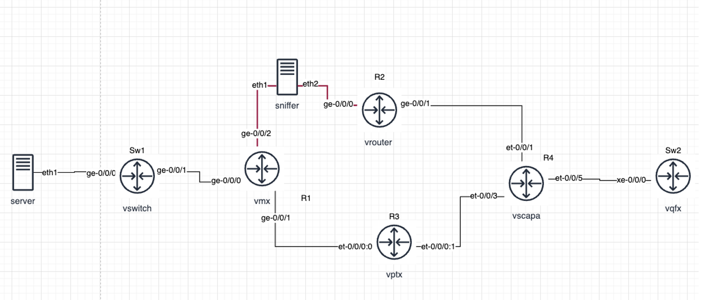

# 🧠 VMM Orchestrator – Use Case Example

This document explains how to use the **VMM Orchestrator** script to build, manage, and automate lab topologies in a QPOD environment.

---

## ⚙️ Supported VM Types

| VM Type | Role | Example Image | Interface Pattern | Disk Variable |
|----------|------|----------------|------------------|---------------|
| `vmx` | Routing | `junos-virtual-x86-64-23.4R2-S3.9.vmdk` | `ge-0/0/<*>` | `vmx_disk<*>` |
| `vrouter` | Routing | `vJunos-router-24.2R2-S1.6.qcow2` | `ge-0/0/<*>` | `VROUTER_DISK<*>` |
| `vswitch` | Switching | `vJunos-switch-24.2R2-S1.6.qcow2` | `ge-0/0/<*>` | `VSWITCH_DISK<*>` |
| `vptx` | Routing | `junos-virtual-x86-64-23.4R2-S3.9.vmdk` | `et-0/0/<*>:<*>` | `vptx_disk<*>` |
| `vscapa` | EVO | `junos-evo-install-ptx-x86-64-23.4R2-S1.7-EVO.iso` | `et-0/0/<*>` | `vscapa_disk<*>` |
| `server` | Linux host | `ubuntu-22.04.qcow2` | `em<*>` | `server_disk<*>` |
| `sniffer` | Traffic capture | `ubuntu-22.04.qcow2` | `eth<*>` | `sniffer_disk<*>` |
| `vqfx` | Switching | `jinstall-vqfx-10-f-21.3R3.10.img` | `xe-0/0/<*>` | `vqfx_disk` |

---

## 🪜 Step 1: Prepare the Python Environment

On your **QPOD**, create a virtual environment and install dependencies:

```bash
pip3 install --user virtualenv --index-url https://pypi.org/simple
python3 -m virtualenv venv
source venv/bin/activate
pip3 install pyyaml jinja2 junos-eznc paramiko pexpect --index-url https://pypi.org/simple
```

Copy the script files to your working directory:

```bash
(venv) $ ls
lab_template.j2  topo.yml  vmm.py
```

---

## 🗺️ Step 2: Define the Topology (`topo.yml`)

<p align="center">
  
</p>


Example topology file:

```yaml
lab_name: DEMO-LAB

disks:
  VROUTER_DISK: /vmm/data/base_disks/junos/vmx/vJunos-router-24.2R2-S1.6.qcow2
  VSWITCH_DISK: /vmm/data/base_disks/junos/vex/vJunos-switch-24.2R2-S1.6.qcow2
  vmx_disk: /vmm/data/base_disks/junos/vmx/junos-virtual-x86-64-23.4R2-S3.9.vmdk
  server_disk: /vmm/data/base_disks/ubuntu/ubuntu-22.04.qcow2
  vqfx_disk: /homes/mchitu/images/jinstall-vqfx-10-f-21.3R3.10.img
  sniffer_disk: /vmm/data/base_disks/ubuntu/ubuntu-22.04.qcow2
  vscapa_disk: /vmm/data/base_disks/junos/vevo/junos-evo-install-ptx-x86-64-23.4R2-S1.7-EVO.iso
  vptx_disk: /vmm/data/base_disks/junos/vmx/junos-virtual-x86-64-23.4R2-S3.9.vmdk

vms:
  - hostname: server
    type: server
    disk: server_disk
    ncpus: 2
    memory: 2048

  - hostname: Sw1
    type: vswitch
    disk: VSWITCH_DISK

  - hostname: R1
    type: vmx
    disk: vmx_disk

  - hostname: R2
    type: vrouter
    disk: VROUTER_DISK

  - hostname: R3
    type: vptx
    disk: vptx_disk

  - hostname: R4
    type: vscapa
    disk: vscapa_disk

  - hostname: Sw2
    type: vqfx
    disk: vqfx_disk

  - hostname: Sniffer
    type: server
    disk: sniffer_disk
    ncpus: 4
    memory: 2048

links:
  - endpoints: ["server:em1", "Sw1:ge-0/0/0"]
  - endpoints: ["Sw1:ge-0/0/1", "R1:ge-0/0/0"]
  - endpoints: ["R1:ge-0/0/1", "R3:et-0/0/0:0"]
  - endpoints: ["R1:ge-0/0/2", "R2:ge-0/0/0"]
    sniffer: true
  - endpoints: ["R2:ge-0/0/1", "R4:et-0/0/1"]
  - endpoints: ["R3:et-0/0/0:1", "R4:et-0/0/3"]
  - endpoints: ["R4:et-0/0/5", "Sw2:xe-0/0/0"]
```

---

## ▶️ Step 3: Run the Script

```bash
(venv) $ python3 vmm.py
```

The script executes in phases:

1. **Generate configuration**
2. **Start lab**
3. **Wait for VMs**
4. **Apply baseline configurations**

At completion, you’ll see a summary table with device states and IPs.

---

## 🧩 Step 4: Check Lab Details

```bash
(venv) $ python3 vmm.py --lab_detail
```

Displays deployment summary and link mapping between devices.

---

## 💾 Step 5: Get or Push Device Configurations

```bash
(venv) $ python3 vmm.py --config
```

Choose whether to **get** or **push** configurations to active Junos devices.

Example output:
```
✅ Configuration for R1 (10.52.39.148) saved to default-config/R1.conf
✅ Configuration for R2 (10.52.49.193) saved to default-config/R2.conf
...
```

---

## 🔍 Step 6: Packet Capture at Sniffer

On the Sniffer VM:

```bash
root@ubuntu:~# brctl show
bridge name   bridge id           STP enabled  interfaces
br1           8000.fe0ca71458f2   no           eth1
                                                eth2

root@ubuntu:~# tcpdump -i br1
listening on br1, link-type EN10MB (Ethernet), snapshot length 262144 bytes
```

---

## 🧾 Notes

- For optimal performance, ensure base images and disk paths are valid.
- Use the latest Junos and Ubuntu images supported by your VMM platform.
- `--lab_detail` and `--config` options can be used at any time after initial deployment.

Sniffer does not support LACP! Use only P2P links for the Sniffer! 

---

© Juniper Networks, Inc. – *For internal use only.*